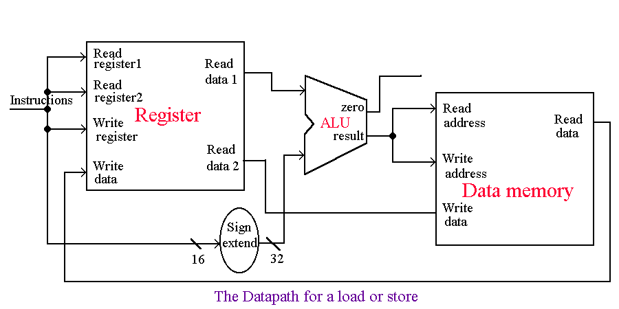
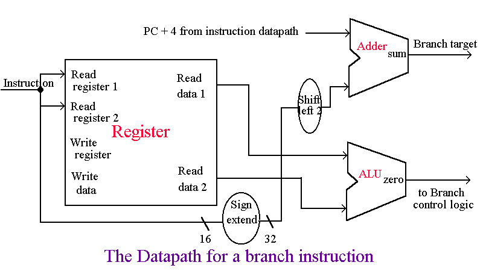
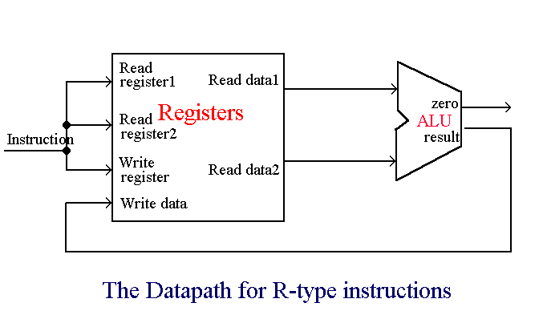

#Linkความรู้ต่างๆ

- คลิปที่ 1
เป็นคลิปที่อธิบายคำสั่ง Jump ในภาษา MIPS(million instructions per second)
  ปกติการทำงานของโปรแกรมจะทำงานตามเรียงลำดับคำสั่งจนจบโปรแกรม ในบางกรณี อาจะมีความต้องการให้โปรแกรมกระโดดข้ามบางบรรทัดคำสั่ง หรือให้ย้อนกลับไปทำบางคำสั่งซ้ำใหม่ในลักษณะวนรอบ คำสั่งกระโดดจึงเป็นคำสั่งที่สั่งให้หน่วยประมวลผลกระโดดไปทำงานที่ตำแหน่งอื่นๆ รูปแบบทั่วไปของคำสั่งกระโดด

 **Clip-1**(https://youtu.be/0736qy-U0ZM)
- คลิปที่ 2
เป็นคลิปยกตัวอย่างการทำงานของ CPU ในภาษา MIPS(million instructions per second)
  หน่วยประมวลผลกลางหรือ CPU นั้น เป็นศูนย์กลางในการทำงานของระบบคอมพิวเตอร์ ทุกสิ่งที่กล่าวถึงในสถาปัตยกรรมชุดคำสั่งนั้น หน่วยประมวลผลกลางจะต้องมีความสามารถทำงานได้ตามที่ระบุไว้ หากเปรียบเทียบร่างกายเราอาจกล่าวได้ว่าหน่วยประมวลผลกลางเป็นสมองมนุษย์เรา ทั้งนี้ภายในหน่ววยประมวลผลกลางจะประกอบไปด้วย 
-หน่วยประมวลผลทางคณิตศาสตร์และทางตรรกะ(ALU)
-หน่วยควบคุม(Control Unit)
-หน่วยความจำชั่วคราว(Register)

-https://youtu.be/8yq_oa1HVa0
- คลิปที่ 3
เป็นคลิปอธิบายความแตกต่างระหว่าง Single Cycle กับ Multi Cycle
  Single Cycle จะทำงานจบภายใน CyCle เดียว ส่วน Multi Cycle จะทำงานจบในหลาย CyCle
  Single Cycle มี ALU ได้หลายตัว ส่วน Multi CyCle จะมี ALU เพียงตัวเดียว
  Single Cycle มี Memmoryตัวเดียว เป็นแบบ Harvard Architecture ส่วน MultiCycle มี Memmoryหลายตัวเป็นแบบ Von Numen 

-https://www.youtube.com/watch?v=FVBvfoPVggo&feature=share
- คลิปที่ 4
เป็นคลิปอธิบายคำสั่ง lw(load word)

ขั้นตอนการทำงานของLoad word ( lw rt,offset(rs) )
1. คำสั่งจะถูกFetch จาก Memory และ จะเพิ่มค่าPC (program counter) เพื่อไปชี้
Address ถัดไปของคำสั่งถัดไป
2. อ่านค่า register (rs)
3. ALU จะคำนวณหาผลรวมของค่าRegister ที่อ่านได้กับค่าOffset
(16 bits จึงต้องทำให้เป็น32 bits)
4. ผลลัพธ์จากALU จะใช้เป็น Addressสำหรับ Data Memory
5. data จาก Memory unit จะถูกเขียนลงในRegister ปลายทาง (rt)

-https://www.youtube.com/watch?v=Wrj4nHQCamU&feature=share
- คลิปที่ 5
เป็นคลิปอธิบายคำสั่ง beq(branch equal)

ถ้า Condition เป็นจริง, Address ของคำสั่งถัดไปจะเป็นค่าPC ใหม่
ขั้นตอนการทำงานของBranch Instruction Set ( beq $x,$y,offset )
1. คำสั่งจะถูกFetch จาก Memory และ จะเพิ่มค่าPC (program counter) เพื่อไปชี้
Address ถัดไปของคำสั่งถัดไป
2. Register ทั้ง 2, $x และ $yจะถูกอ่านเข้ามา
3. ALU จะทำการลบ (Substract)ที่อ่านเข้ามา
นำค่าที่ PC+4 ไปบวกกับค่าOffset (16 bit) ได้ผลลัพธ์เป็น"Branch target Address"
4. ขา zero ที่ออกจากALU ถูกใช้ในการตัดสินใจ

-https://youtu.be/X2lB1ZSHdHE
- คลิปที่ 6
เป็นคลิปอธิบาย R type

พวก R-type Instruction, จะทำการอ่าน2 Register นำมาทำ ALU Operationแล้วเก็บค่าที่ได้ใน
Register 
ขั้นตอนการทำงานของR-Type Instruction Set
1. คำสั่งจะถูกFetch จาก Memory และ จะเพิ่มค่าPC (program counter) เพื่อไปชี้
Address ถัดไปของคำสั่งถัดไป
2. Register 2 ตัว จะถูกอ่าน, ตัว Main Control Unit จะ set controlline
3. ALU operate data ที่เข้ามาโดยใช้ Function Code(bits 5-0) ของคำสั่งในการเลือกใช้ALU Function
4. เขียนผลลัพธ์ที่ได้ลงในRegister (bits 15-11)
-https://youtu.be/MKwHdwCq7HY
- คลิปที่ 7
เป็นคลิปอธิบาย Pipelining
ในคอมพิวเตอร์ Pipelining หมายถึงการเคลื่อนย้ายที่ซ้อนกัน (Over lapped) ของคำสั่ง ไปยังกระบวนการหรือขั้นตอนทางเลขคณิต โดยตัวประมวยผลเพื่อทำงานตามคำสั่ง Pipelining คือการใช้ Pipeline ถ้าไม่มี Pipeline ตัวประมวลผลของคอมพิวเตอร์จะเรียกคำสั่งแรกจากหน่วยความจำ และทำการประมวลผลจนเสร็จสิ้น จากนั้นจึงเรียกคำสั่งต่อไปจากหน่วยความจำ ในขณะที่ทำการเรียกคำสั่งใหม่ ส่วนเลขคณิตของตัวประมวลผลจะว่าง เพื่อรอคำสั่งต่อไป ถ้ามี Pipeline สถาปัตยกรรมของคอมพิวเตอร์จะยินยอมให้นำคำสั่งต่อไปมาเก็บไว้ใน buffer ที่ใกล้กับตัวประมวลผล เพื่อทำให้ตัวประมวลผลเรียกคำสั่งใหม่ได้เร็วขึ้น และสามารถทำงานได้ต่อเนื่อง จึงทำให้การทำงานทำได้เร็วขึ้น
Pipelining ของตัวประมวลผลในคอมพิวเตอร์ จะแบ่งเป็น Pipeline ของคำสั่งและ Pipeline ของเลขคณิต โดย Pipeline ของคำสั่งจะเสนอขั้นตอนของคำสั่งในเคลื่อนที่ไปยังตัวประมวลผล รวมถึงการเรียก การสำรอง และทำงาน ส่วน Pipeline ของเลขคณิต เสนอตัว Operator ทางเลขคณิต ซึ่งสามารถแยกออกและซ้อนกันเมื่อมีการทำงาน Pipelines และ Pipelining ได้รับการประยุกต์กับตัวควบคุมหน่วยความจำและการย้ายข้อมูลไปยังขั้นต่าง ๆ ของหน่วยความจำ

ปัญหาด้านการควบคุม (Control Hazards) ปัญหาของการทำงานแบบไปป์ลายน์คือ หากคำสั่ง i ที่ j ที่กำลังถอดรหัสเป็นคำสั่งกระโดด และผลลัพธ์จากการทำคำสั่งทำให้เกิดการกระโดดไปยังแอดเดรสเป้าหมายแล้วโพรเซสเซอร์จะต้องทิ้งคำสั่งที่ i ที่ j+1 ไปจนถึงคำสั่งที่ i ที่ j+n-1 เมื่อ n เท่ากับจำนวนสเตท ซึ่งเป็นคำสั่งที่อยู่หลังคำสั่งกระโดดและเริ่มเฟตซ์คำสั่งที่ i ที่ k ซึ่งเป็นแอดเดรสเป้าหมายของการกระโดดใหม่

ปัญหาด้านการขึ้นต่อกันของข้อมูล(Data Hazards) ปัญหาData hazard เกิดจากคำสั่ง i ที่ j ต้องใช้ผลลัพธ์ที่ได้จากการทำคำสั่ง i ที่ j-1 ซึ่งเป็นคำสั่งที่อยู่ก่อนหน้าคำสั่ง i ที่ j นี้ทำให้คำสั่ง i ที่ j ต้องรอให้การทำงานของคำสั่ง i ที่ j - 1 ทำการเขียนผลลัพธ์จนเสร็จสิ้นเสียก่อนจึงจะเริ่มเฟตซ์โอเปอแรนด์ที่ต้องการในการทำคำสั่งนั้นไปใช้งานได้

ปัญหาด้านโครงสร้าง(Structural Hazards) แม้ว่าเทคนิคในทางหลักการแล้วไปป์ลายน์จะช่วยเพิ่มความเร็วในการทำงานโดยการทำหลายๆคำสั่งพร้อมๆกันแต่บนงานที่แตกต่างกันแต่ในการนำไปสร้างวงจรใช้งานจริงกลับประสบปัญหาหลายๆด้าน อันเนื่องมาจาก อุปกรณ์หลายๆ ตัวไม่สนับสนุนการทำงานแบบขนาน ยกตัวอย่างเช่น หน่วยความจำ ในการทำงานแบบไปป์ลายน์นั้นผู้ออกแบบต้องการให้สเตทเฟตซ์สามารถอ่านหน่วยความจำในขฯะที่สเตทการถอดรหัสอาจจำเป็นต้องอ่านค่าจากหน่วยความจำซึ่งอีกคำสั่งในไปป์ลายน์ต้องการและใช้ขณะเดียวกันสเตทการเขียนผลลัพธ์ก็ต้องการเขียนผลลัพธ์การทำงานลงสู่หน่วยความจำเช่นกัน จะเห็นได้ว่ามีสเตทจำนว สามสเทด้วยกันที่ต้องการเข้าถึงหน่วยความจำพร้อมๆกันซึ่งปกติแล้วหน่วยความจำทั่วๆไปไม่สนับสนุนให้อุปกรณ์หลายๆตัว เข้าถึงข้อมูลได้พร้อมๆกัน การแก้ปัญหาคือการใช้สถาปัตยกรรมแบบ Harvard ซึ่งแยกหน่วยความจำของโปรแกรมและข้อมูลออกจากกันอย่างเด็ดขาดส่งผลให้สามารถเฟตซ์โปรแกรมจากหน่วยความจำโปรแกรมได้พร้อมๆ กับการเขียนข้อมูลผลลัพธ์จากการทำโปรแกรมลงสู่หน่วยความจำข้อมูล

-https://youtu.be/x1Z5_TWaLLM
